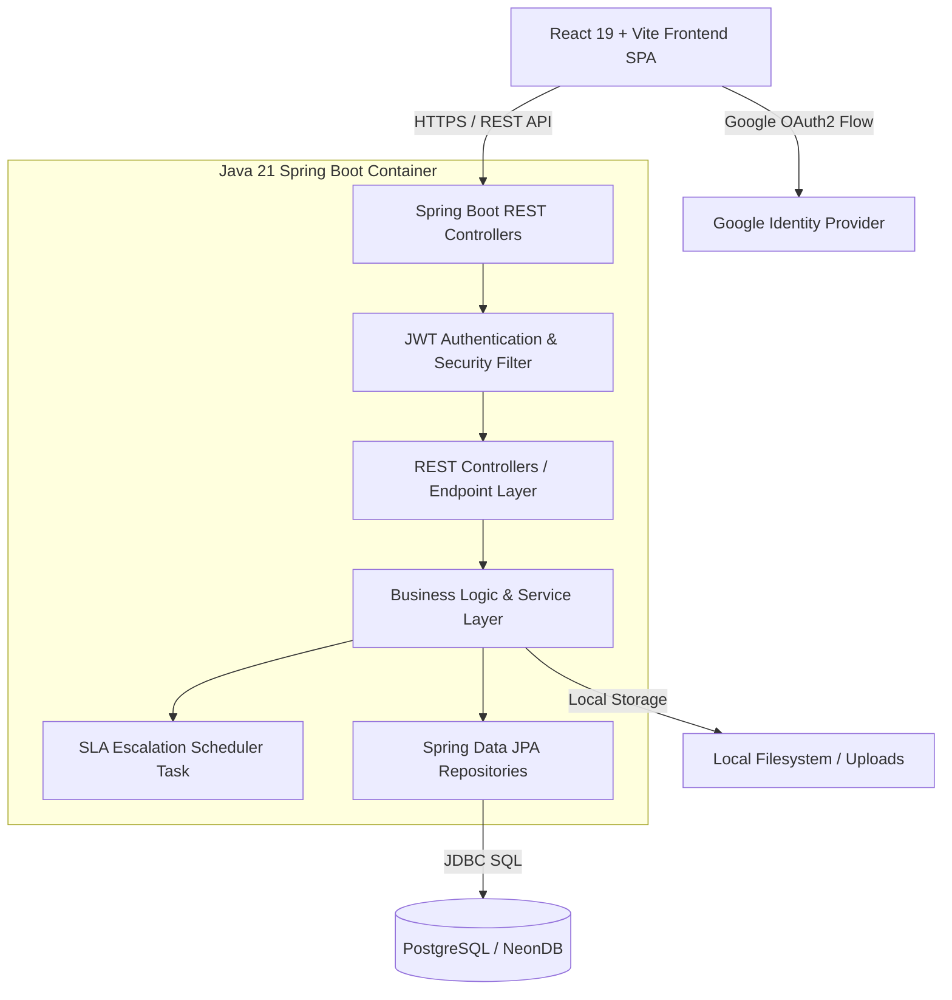
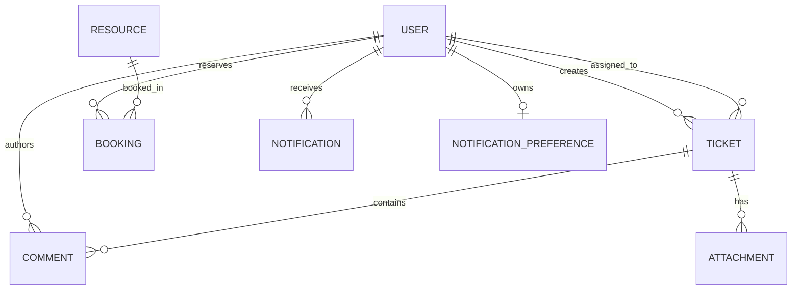

# 🏫 Smart Campus Operation Hub

> **Integrated Enterprise Campus Operations, Facility Maintenance & Resource Booking Platform**  
> *A full-stack web platform built to handle day-to-day operations at higher education institutions, submitted in partial fulfillment of the requirements for the BSc (Hons) in Information Technology at SLIIT.*

---

[](https://www.oracle.com/java/)
[](https://spring.io/projects/spring-boot)
[](https://react.dev/)
[](https://vitejs.dev/)
[](https://tailwindcss.com/)
[](https://neon.tech/)
[](https://jwt.io/)
[](#license)

---

## 📌 Table of Contents

- [Overview & System Vision](#-overview--system-vision)
- [Problems Solved](#-problems-solved)
- [Core Features & Modules](#-core-features--modules)
  - [1. User Management & Onboarding Security](#1-user-management--onboarding-security)
  - [2. Maintenance Ticket System & SLA Engine](#2-maintenance-ticket-system--sla-engine)
  - [3. Campus Resource Reservation Engine](#3-campus-resource-reservation-engine)
  - [4. Campus Resource Catalog & Smart Finder](#4-campus-resource-catalog--smart-finder)
  - [5. Event-Driven Notification System](#5-event-driven-notification-system)
  - [6. Operational Analytics & Intelligence Dashboard](#6-operational-analytics--intelligence-dashboard)
- [System Architecture & Design](#-system-architecture--design)
  - [High-Level Architecture](#high-level-architecture)
  - [Data Model & Entity Relationships](#data-model--entity-relationships)
- [Technology Stack](#-technology-stack)
- [Project Directory Structure](#-project-directory-structure)
- [API Reference](#-api-reference)
- [Getting Started & Local Setup](#-getting-started--local-setup)
  - [Prerequisites](#prerequisites)
  - [1. Clone Repository](#1-clone-repository)
  - [2. Backend Setup](#2-backend-setup)
  - [3. Frontend Setup](#3-frontend-setup)
  - [4. Initial Admin Account Bootstrap](#4-initial-admin-account-bootstrap)
- [Deployment Guide](#-deployment-guide)
- [Known Limitations & Future Roadmap](#-known-limitations--future-roadmap)
- [License & Acknowledgments](#-license--acknowledgments)

---

## 🌐 Overview & System Vision

Higher education campuses function as micro-cities. On any given day, thousands of students, faculty, maintenance staff, and administrators interact with hundreds of physical facilities—lecture halls, specialized laboratories, AV equipment, study rooms, and recreational areas.

Without a centralized operational hub, campus management degrades into operational chaos:
* Maintenance issues are communicated through informal channels or buried in emails.
* Facilities and expensive lab gear are double-booked or sit underutilized.
* Service Level Agreements (SLAs) for critical facilities failures (e.g., power outages in exam halls, broken air conditioning in server rooms) are completely unmonitored.
* Operational leaders lack data to make informed budgeting and maintenance decisions.

**Smart Campus Operation Hub** bridges these gaps by delivering an enterprise-grade, end-to-end platform that unifies maintenance ticket tracking, smart resource booking, automated SLA escalation, real-time notifications, and high-level operational analytics.

---

## ⚡ Problems Solved

| Operational Problem | Traditional Bottleneck | Smart Campus Hub Solution |
| :--- | :--- | :--- |
| **Operational Fragmentation** | Disjointed emails, physical paperwork, and verbal reports led to untracked maintenance issues. | **Centralized Incident Lifecycle**: Ticket lifecycle management (`OPEN` → `IN_PROGRESS` → `RESOLVED` → `CLOSED`) with full comment histories, technician assignments, and file attachments. |
| **Unmonitored SLA Breaches** | Critical facility failures lingered without resolution deadlines or accountability. | **Automated SLA Engine**: Priority-driven resolution windows (Critical: 4h, High: 24h, Medium: 48h, Low: 72h). Background cron jobs (`SlaEscalationScheduler`) detect imminent breaches and escalate to managers. |
| **Resource Double-Bookings** | Overlapping spreadsheets and manual booking approvals resulted in classroom collisions. | **Collision-Proof Reservation Engine**: Real-time availability calendars, instant conflict validation algorithms, and custom approval workflows (Auto-approval vs. Admin Review). |
| **Manual Resource Matching** | Students struggled to identify spaces matching specific criteria (e.g., room capacity, projector availability). | **Smart Resource Finder**: Algorithmic resource recommendation engine matching location, capacity, resource type, and required amenities to user requests. |
| **Unvetted User Access** | Open registration risked unauthorized administrative or booking access. | **OAuth2 + Admin Approval Gate**: Passwordless Google Authentication coupled with a multi-stage user approval state machine (`PENDING` → `APPROVED` / `REJECTED` / `SUSPENDED`) and fine-grained RBAC. |
| **Operational Blind Spots** | Facilities leaders lacked visibility into equipment failure patterns and department efficiency. | **Real-Time Analytics Dashboard**: Visual metrics tracking ticket category trends, SLA compliance rates, resource utilization metrics, and exportable reports. |

---

## 🚀 Core Features & Modules

### 1. User Management & Onboarding Security

* **Google OAuth2 Passwordless Auth**: Integrates Spring Security OAuth2 with Google Sign-In, eliminating credential storage vulnerabilities.
* **JJWT Token Architecture**: Backend issues 24-hour stateless JSON Web Tokens (JWT) containing user identity and role claims.
* **Onboarding Approval Workflow**: Newly authenticated accounts start in a `PENDING` state. Access to protected features is restricted until an `ADMIN` approves the user account.
* **Role-Based Access Control (RBAC)**: Enforces 4 distinct permission roles across client routes and server endpoints:
  * 👑 **`ADMIN`**: Complete administrative control—user status approval, role escalation, resource catalog management, ticket overriding, system analytics.
  * 👔 **`MANAGER`**: Operational oversight—ticket triage, technician assignment, booking approvals, analytics inspection.
  * 🛠️ **`TECHNICIAN`**: Maintenance execution—assigned ticket queue management, status updating (`IN_PROGRESS`, `RESOLVED`), resolution documentation.
  * 🎓 **`USER`**: General campus community (Students/Faculty)—submit maintenance tickets, request resource reservations, track personal history.

---

### 2. Maintenance Ticket System & SLA Engine

* **End-to-End Ticket Lifecycle**: Supports progression through `OPEN`, `IN_PROGRESS`, `RESOLVED`, `CLOSED`, and `REJECTED` states.
* **Priority & SLA Matrix**:
  * 🔴 **Critical**: 4-Hour SLA Target (e.g., power failures, severe leaks, security risks)
  * 🟠 **High**: 24-Hour SLA Target (e.g., main projector failure in primary auditorium)
  * 🟡 **Medium**: 48-Hour SLA Target (e.g., broken furniture, non-critical lighting)
  * 🟢 **Low**: 72-Hour SLA Target (e.g., minor cosmetic fixes)
* **Automated Smart Triage**: Client-side keyword evaluation suggests appropriate category (`ELECTRICAL`, `PLUMBING`, `HVAC`, `IT_EQUIPMENT`, `FURNITURE`, `CLEANING`, `SAFETY`, `OTHER`) and priority level based on description text.
* **Background SLA Escalation Scheduler**: Spring `@Scheduled` background worker scans open tickets every hour. Tickets within 2 hours of SLA breach automatically trigger push notifications to assigned technicians and administrative reviewers.
* **Interactive Ticket Detail & Collaboration**: Real-time comment threads, resolution notes, and attachment uploads (`.png`, `.jpg`, `.pdf`, `.docx`).

---

### 3. Campus Resource Reservation Engine

* **Conflict-Free Scheduling**: Backend checks for temporal overlaps prior to committing bookings to the database.
* **Approval Workflows**:
  * **Auto-Approved**: Standard resources (e.g., regular study desks, basic equipment) are automatically confirmed.
  * **Admin Review Required**: High-demand facilities (e.g., auditoriums, specialized research labs) enter `PENDING_APPROVAL` status requiring `MANAGER`/`ADMIN` authorization.
* **Dynamic QR Code Check-In**: Generates unique QR codes for confirmed bookings (`QRCode.react`) allowing quick on-site verification.
* **Interactive Calendar Views**: Grid and list views powered by `date-fns` displaying real-time availability slots.

---

### 4. Campus Resource Catalog & Smart Finder

* **Comprehensive Inventory Tracking**: Centralized repository of all campus spaces (Classrooms, Computer Labs, Lecture Halls, Conference Rooms) and portable assets (Laptops, Projectors, Microphones, Lab Kits).
* **Resource Status Lifecycle**: Tracks operational state (`AVAILABLE`, `MAINTENANCE`, `DECOMMISSIONED`, `BOOKED`).
* **Smart Resource Finder**: Interactive search tool that filters campus assets based on:
  * Capacity requirements (minimum student/attendee count)
  * Building location and floor
  * Resource classification and specific amenities (e.g., Smartboard, Audio system)

---

### 5. Event-Driven Notification System

* **Multi-Channel Triggering**: System automatically dispatches in-app notifications for key lifecycle events:
  * Ticket status progression (e.g., assigned, marked in-progress, resolved)
  * Imminent SLA breach alerts
  * Booking approval, rejection, or cancellation
  * Comment replies on followed tickets
* **User Preferences Control**: Users can toggle notifications on a granular level per notification type.
* **In-App Bell & History Log**: Unread badge count dropdown in top navigation bar paired with a full searchable notification history page.

---

### 6. Operational Analytics & Intelligence Dashboard

* **High-Level KPIs**: Real-time summary tiles displaying total ticket volume, active issues, overall SLA compliance rate (%), total campus resources, and pending user approvals.
* **Interactive Data Visualization** (Powered by `Recharts`):
  * **Category Distribution**: Donut/Pie charts breaking down issues by domain (Electrical, IT, HVAC, etc.).
  * **Priority Split**: Bar charts illustrating severity distribution.
  * **SLA Performance**: Visual tracking of met vs. breached SLAs over selectable time ranges.
  * **Resource Utilization**: Utilization metrics identifying most/least requested campus facilities.
* **Exportable Reports**: Enables facility managers to export raw operational data for auditing.

---

## 🏗️ System Architecture & Design

### High-Level Architecture

The project follows a decoupled client-server architecture utilizing RESTful JSON communication over HTTPS.



---

### Data Model & Entity Relationships



---

## 🛠️ Technology Stack

### Frontend (Client-Side)

| Framework / Tool | Version | Purpose |
| :--- | :--- | :--- |
| **React** | 19.0 | Component-driven user interface |
| **Vite** | 8.0 | Next-generation frontend build tool and dev server |
| **React Router** | 7.0 | Declarative client-side routing & protected routes |
| **Tailwind CSS** | 4.0 | Utility-first responsive design framework |
| **Recharts** | 3.0 | Modern composable charting library |
| **Axios** | 1.15 | Promise-based HTTP client with centralized interceptors |
| **Lucide React** | 1.0+ | Modern UI icon suite |
| **QRCode.react** | 4.0+ | SVG/Canvas QR code renderer |
| **date-fns** | 4.0 | Date parsing, manipulation, and SLA countdown math |
| **Swiper** | 11.0 | Mobile-touch responsive sliders & carousels |

### Backend (Server-Side)

| Framework / Tool | Version | Purpose |
| :--- | :--- | :--- |
| **Java** | 21 LTS | Modern Java runtime featuring virtual threads |
| **Spring Boot** | 3.4 / 4.0 | Enterprise Java application framework |
| **Spring Security** | 6.x | Comprehensive authentication, authorization & CORS config |
| **Spring Data JPA** | 3.x | Object-Relational Mapping (Hibernate implementation) |
| **PostgreSQL** | 16+ | Relational SQL database engine (Hosted on NeonDB) |
| **JJWT (Java JWT)**| 0.12.6 | Cryptographic JWT signing (`HS256`) and verification |
| **Spring OAuth2 Client**| 6.x | Google OAuth2 token exchange & identity parsing |
| **Maven** | 3.9+ | Build automation and dependency management |

### Infrastructure & DevOps

| Platform / Tool | Target | Configuration |
| :--- | :--- | :--- |
| **NeonDB** | Cloud Database | Serverless PostgreSQL with SSL connection pooling |
| **Vercel** | Frontend Hosting | Single Page Application rewrites (`vercel.json`) |
| **Railway** | Backend Hosting | Docker containerized deployment (`railway.toml`) |
| **Docker** | Containerization | Multi-stage Eclipse Temurin JDK 21 Alpine image |

---

## 📁 Project Directory Structure

```
smart-campus-operation-hub/
├── smart-campus-operation-hub/                # Main Application Folder
│   ├── backend/                               # Spring Boot 3/4 Java 21 Web Application
│   │   ├── src/main/java/com/example/smart_campus_operation_hub/
│   │   │   ├── config/                        # Web Security, CORS, OpenAPI configs
│   │   │   ├── controller/                    # REST Controllers (8 Endpoints)
│   │   │   ├── dto/                           # Data Transfer Objects (Requests/Responses)
│   │   │   ├── enums/                         # Domain Enums (Roles, Statuses, Categories)
│   │   │   ├── exception/                     # Global Exception Handlers & Custom Errors
│   │   │   ├── model/                         # JPA Database Entities (8 Tables)
│   │   │   ├── repository/                    # Spring Data JPA Repositories
│   │   │   ├── scheduler/                     # Background Cron Jobs (SlaEscalationScheduler)
│   │   │   ├── security/                      # JwtFilter, OAuth2SuccessHandler, TokenProvider
│   │   │   ├── service/                       # Core Service Layer Logic
│   │   │   └── util/                          # Helper Utilities
│   │   ├── src/main/resources/
│   │   │   └── application.yml                # Database & Spring Configurations
│   │   ├── Dockerfile                         # Container build file for backend
│   │   ├── .env.example                       # Backend environment template
│   │   └── pom.xml                            # Maven dependencies
│   │
│   ├── frontend/                              # React 19 + Vite Web Client
│   │   ├── src/
│   │   │   ├── api/                           # Modular Axios HTTP Client API files
│   │   │   ├── components/                    # Reusable Component Hierarchy
│   │   │   ├── context/                       # React Context (AuthContext, ToastContext)
│   │   │   ├── hooks/                         # Custom React Hooks
│   │   │   ├── pages/                         # Router Page Views
│   │   │   ├── styles/ & index.css            # Tailwind CSS v4 Custom Design Tokens
│   │   │   ├── App.jsx                        # Route Registry & Layout Enclosure
│   │   │   └── main.jsx                       # Application Entry Point
│   │   ├── .env.example                       # Frontend environment template
│   │   ├── package.json                       # Node.js dependencies
│   │   └── vite.config.js                     # Vite build settings
│   │
│   ├── docs/                                  # SRS & Postman Collections
│   │   ├── SRS.md                             # Software Requirements Specification
│   │   └── postman/                           # API Postman Collections
│   ├── vercel.json                            # Vercel Frontend SPA Routing configuration
│   └── railway.toml                           # Railway Container Deployment config
│
└── README.md                                  # Repository Root README
```

---

## 📡 API Reference

All backend API routes are prefixed with `/api/v1`. Authenticated endpoints require a standard HTTP Authorization header: `Bearer <JWT_TOKEN>`.

| Module | HTTP Method | Endpoint Path | Description | Access Required |
| :--- | :--- | :--- | :--- | :--- |
| **Auth** | `POST` | `/api/v1/auth/google` | Exchange Google OAuth ID token for JWT token | Public |
| **Auth** | `GET` | `/api/v1/auth/me` | Retrieve authenticated user identity & profile | Authenticated |
| **Users** | `GET` | `/api/v1/users` | List all system users with status filtering | `ADMIN` |
| **Users** | `PUT` | `/api/v1/users/{id}/status` | Update user status (`APPROVED`, `REJECTED`, `SUSPENDED`) | `ADMIN` |
| **Users** | `PUT` | `/api/v1/users/{id}/role` | Escalate or change user role (`ADMIN`, `MANAGER`, etc.) | `ADMIN` |
| **Tickets**| `GET` | `/api/v1/tickets` | List tickets (filtered by user role/ownership) | Authenticated |
| **Tickets**| `POST` | `/api/v1/tickets` | Create a new maintenance ticket | Authenticated |
| **Tickets**| `GET` | `/api/v1/tickets/{id}` | Fetch ticket details, comments, and attachments | Authenticated |
| **Tickets**| `PUT` | `/api/v1/tickets/{id}/status` | Update ticket status (`IN_PROGRESS`, `RESOLVED`, etc.) | `TECHNICIAN`, `MANAGER`, `ADMIN` |
| **Tickets**| `PUT` | `/api/v1/tickets/{id}/assign` | Assign technician to ticket | `MANAGER`, `ADMIN` |
| **Comments**|`POST` | `/api/v1/tickets/{id}/comments`| Add discussion comment to a ticket thread | Authenticated |
| **Bookings**|`GET` | `/api/v1/bookings` | Retrieve user/all resource reservations | Authenticated |
| **Bookings**|`POST` | `/api/v1/bookings` | Submit new resource booking request | Authenticated |
| **Bookings**|`PUT` | `/api/v1/bookings/{id}/status`| Approve, reject, or cancel booking | `MANAGER`, `ADMIN` (or owner) |
| **Resources**|`GET` | `/api/v1/resources` | Query resource catalog with category filters | Authenticated |
| **Resources**|`POST` | `/api/v1/resources` | Add new facility or equipment asset | `MANAGER`, `ADMIN` |
| **Notifications**|`GET`| `/api/v1/notifications` | Fetch user notifications | Authenticated |
| **Notifications**|`PUT`| `/api/v1/notifications/{id}/read`| Mark notification as read | Authenticated |
| **Analytics**|`GET` | `/api/v1/analytics/summary` | Retrieve operational metrics & chart aggregates | `MANAGER`, `ADMIN` |

---

## ⚙️ Getting Started & Local Setup

### Prerequisites

Ensure you have the following software installed locally:
* **Node.js**: `v20.0.0` or higher
* **Java Development Kit (JDK)**: `v21` (LTS)
* **Apache Maven**: `v3.9.0` or higher
* **PostgreSQL Database**: Local PostgreSQL instance OR a free cloud instance on [NeonDB](https://neon.tech/)
* **Google Cloud Console Account**: An active OAuth 2.0 Client ID for Web Applications

---

### 1. Clone Repository

```bash
git clone https://github.com/Dilshan118/Smart_Campus.git
cd Smart_Campus/smart-campus-operation-hub
```

---

### 2. Backend Setup

1. Navigate to the backend directory and copy the environment template:
   ```bash
   cd backend
   cp .env.example .env
   ```

2. Configure your `.env` file with your credentials:
   ```env
   # Database connection string (PostgreSQL)
   DB_URL=jdbc:postgresql://localhost:5432/smart_campus?sslmode=disable
   DB_USERNAME=postgres
   DB_PASSWORD=your_postgres_password

   # Google OAuth2 Credentials (from Google Cloud Console)
   GOOGLE_CLIENT_ID=your-google-client-id.apps.googleusercontent.com
   GOOGLE_CLIENT_SECRET=your-google-client-secret

   # JWT Configuration (Must be at least 256 bits / 32 characters)
   JWT_SECRET=super_secret_jwt_key_that_is_very_long_and_secure_256_bits
   JWT_EXPIRATION=86400000

   # File Upload Storage
   UPLOAD_DIR=./uploads
   MAX_FILE_SIZE=5242880

   # Frontend CORS Origin
   FRONTEND_URL=http://localhost:5173
   ```

3. Build and launch the Spring Boot backend server:
   ```bash
   mvn clean spring-boot:run
   ```
   *The API server will boot on `http://localhost:8080`. Hibernate will automatically generate database tables on initial start.*

---

### 3. Frontend Setup

1. Open a new terminal tab, navigate to the `frontend` folder, and copy the environment template:
   ```bash
   cd frontend
   cp .env.example .env
   ```

2. Configure `.env`:
   ```env
   VITE_API_BASE_URL=http://localhost:8080/api/v1
   VITE_GOOGLE_CLIENT_ID=your-google-client-id.apps.googleusercontent.com
   ```

3. Install dependencies and start the Vite development server:
   ```bash
   npm install
   npm run dev
   ```
   *The web application will open at `http://localhost:5173`.*

---

### 4. Initial Admin Account Bootstrap

Because all newly registered OAuth2 users start in a `PENDING` state:

1. Open `http://localhost:5173` and click **"Sign in with Google"**.
2. Complete Google authentication. You will be redirected to the `/pending-approval` gate.
3. Access your database (via `psql`, DBeaver, or NeonDB console) and execute the bootstrap query to approve and promote your first user:
   ```sql
   UPDATE users 
   SET status = 'APPROVED', role = 'ADMIN' 
   WHERE email = 'your-email@domain.com';
   ```
4. Refresh your browser page. You now have full `ADMIN` privilege access to manage users, configure facilities, and review analytics.

---

## 🚢 Deployment Guide

### Frontend Deployment (Vercel)

The project contains a `vercel.json` file inside `smart-campus-operation-hub` to handle single-page application (SPA) client-side routing.

```bash
cd smart-campus-operation-hub/frontend
npm run build
vercel --prod
```
*Be sure to set `VITE_API_BASE_URL` and `VITE_GOOGLE_CLIENT_ID` in your Vercel Project Settings → Environment Variables.*

### Backend Deployment (Railway / Docker)

The backend includes a production-ready container definition (`Dockerfile`) utilizing a lightweight Alpine JDK runtime.

```bash
cd smart-campus-operation-hub/backend
docker build -t smart-campus-backend .
docker run -p 8080:8080 --env-file .env smart-campus-backend
```

For zero-downtime deployment on Railway, connect your GitHub repository; Railway automatically detects `railway.toml` and `Dockerfile` to build and deploy.

---

## 🔍 Known Limitations & Future Roadmap

While the Smart Campus Operation Hub provides a robust operational foundation, the following enhancements are planned for upcoming releases:

- [ ] **Cloud Storage Integration**: Migrate local file attachments (`./uploads`) to AWS S3 or Cloudinary for persistent storage in multi-instance cloud deployments.
- [ ] **LLM-Powered Auto-Triage**: Upgrade the current keyword-based ticket classification engine to an embedded LLM (e.g., Gemini Flash API) for context-aware priority and category predictions.
- [ ] **STOMP / WebSocket Push Notifications**: Enhance the existing REST-polled notification system with real-time WebSocket push sockets for instant client alerts.
- [ ] **Automated Integration Test Suite**: Expand unit test coverage utilizing JUnit 5, Mockito, and Testcontainers for PostgreSQL.

---

## 📄 License & Acknowledgments

This software was designed and developed as a final-year research and application project in partial fulfillment of the requirements for the **BSc (Hons) in Information Technology** at the **Sri Lanka Institute of Information Technology (SLIIT)**.

All rights reserved © 2025 Smart Campus Operation Hub Team.
